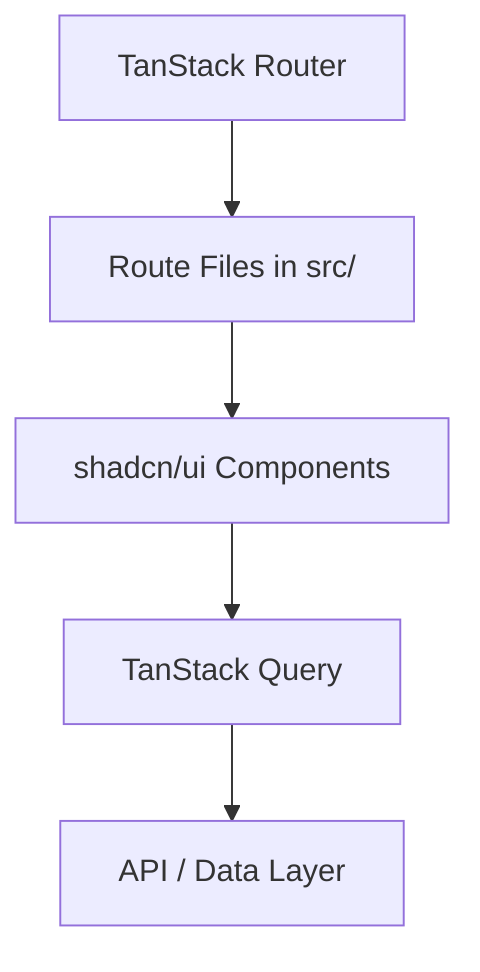

# Architecture Documentation

## Core Stack

TanStack Start + TanStack Router provides SSR-capable file-based routing. TanStack Query handles server state. shadcn/ui (Radix primitives + CVA) provides the component system.

---

**By OutLawZ™** | https://www.brandex.pk | net2tara@gmail.com
